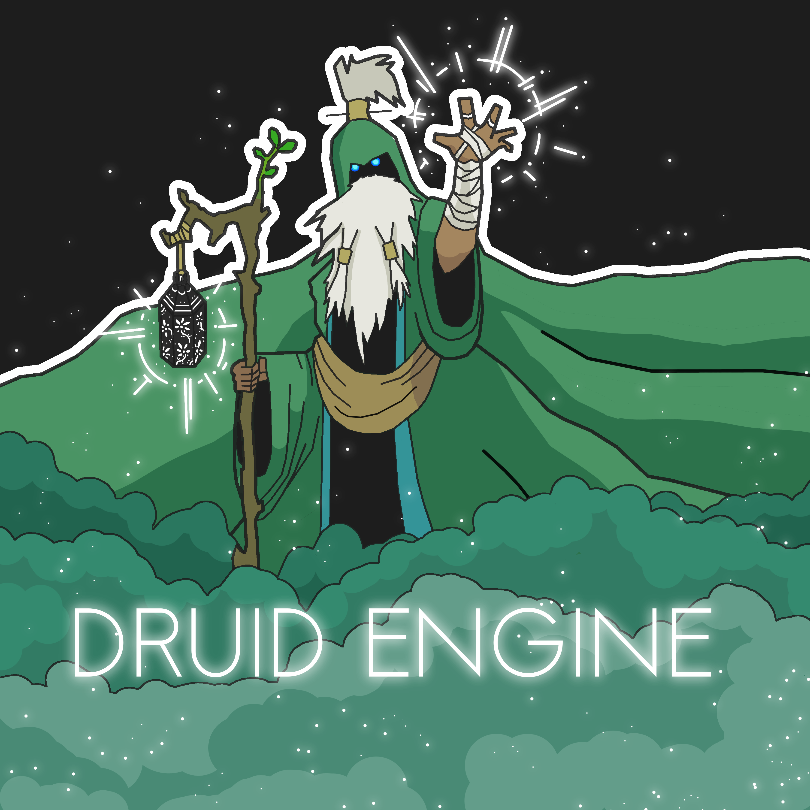

# README
---
## New Engine

> New Engine is a C++ / OpenGL Game Engine made from scratch with the only purpose of improving my gamedev and programming skills.

## Build

### Linux

* First, **download and install dependencies**: `./scripts/dependencies.sh`
* Build project: `./scripts/build.sh -[ruixlch]`
  * -h Show help.
  * -r Compile Release, **Debug by default**.
  * -u Compile Unit Tests suite. (NEEDED BY `test.sh`)
  * -i Compile Integration Tests suite. (NEEDED BY `test.sh`)
  * -x Compile Tools.
  * -l Enable Logs.
  * -c Clean the project.
* Run unitary tests (optional): `./scripts/test.sh`
* Generate documentation (optional): `./scripts/doc.sh`

### Windows

> Not available yet.

---

### Directories

* **code:** Source and Headers.
* **config:** Engine and scenes config files.
* **scripts:** Contains scripts described above.
* **compiledLibs:** Contains the libDruid.a. Generated by `scripts/build.sh`.
* **binaries:** Generated by `scripts/test.sh.`. Contains the test executable files (both unitary and integration).
* **test:** Set of tests. Unitary and Integration.
* **tools:** Set of tools.
* **dependencies:** Generated by `scripts/dependencies.sh.` Contains third party libraries.
* **build:** Generated by `scripts/build.sh`.

---

### Unitary Tests

Run unitary tests with `./scripts/test.sh`. Result are stored in **binaries/output**.
This command will print the results in terminal.

### Integration Tests

Run integration test by executing `./binaries/test_integration`. Result is stored in **log.txt**.

---
